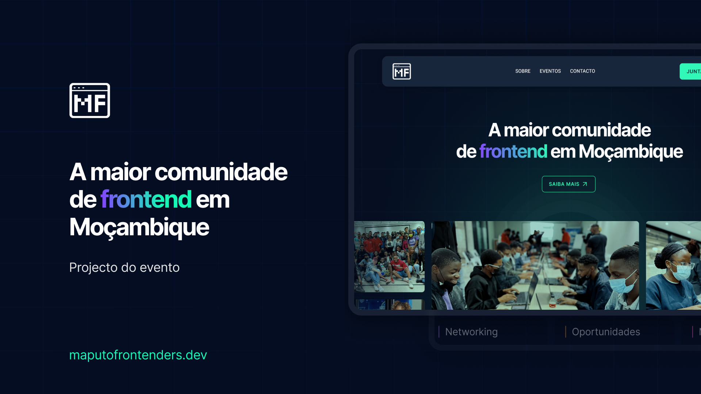

# Website da Comunidade Maputo Frontenders

  

Bem-vindo ao projeto do website da comunidade Maputo Frontenders! Este documento descreve as diretrizes de desenvolvimento e regras para garantir consistência, eficiência e colaboração dentro do projeto.

## Acesso ao Design no Figma

- Você pode visualizar o layout do projeto através [DESSE LINK](https://www.figma.com/design/Zs0uzBN3uvScmB89gQ0DrG/Website-MF?node-id=1-55&t=dEOeUqZTneiyqdPe-1s). É necessário ter conta no [Figma](https://figma.com) para acessá-lo.

## [Colaboração](./CONTRIBUTING.md)
